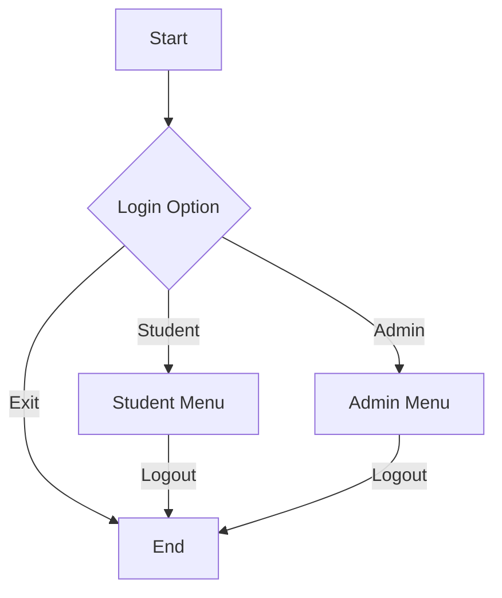
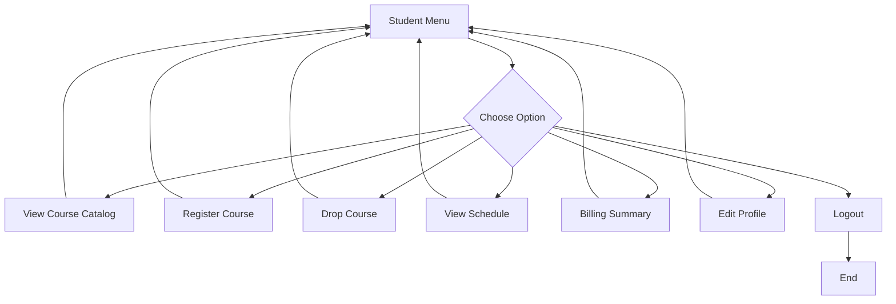
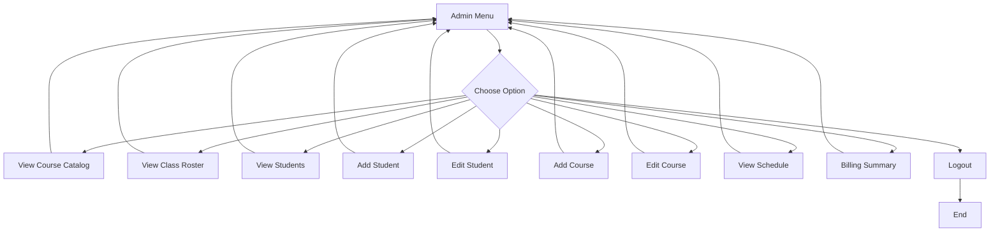

# unknownapp
This is an unknown application written in Java

---- For Submission (you must fill in the information below) ----
### Use Case Diagram


### Flowchart of the main workflow
Main Menu Flow


Student Menu Flow


Admin Menu Flow

### Prompts
```
Using the current "View all students" feature for admin, create an equivalent Python version of the program. Put the Python program in a new folder called “python.”
```