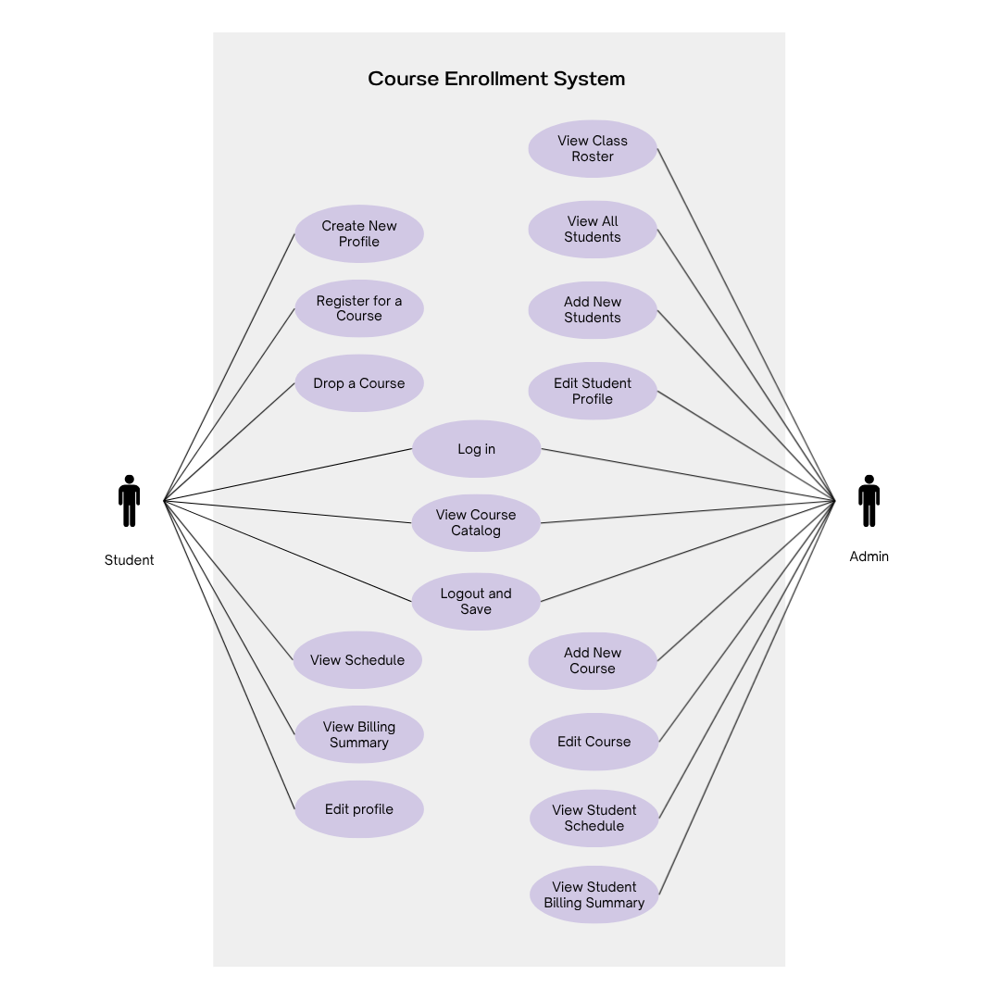
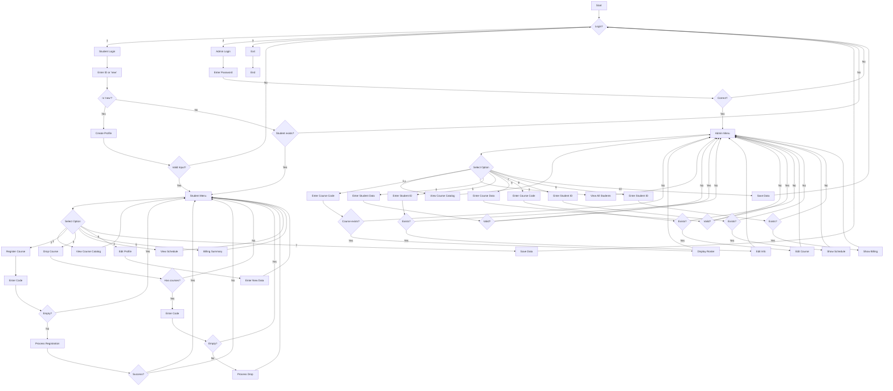

# unknownapp
This is an unknown application written in Java

### Use Case Diagram

### Flowchart of the main workflow

### Prompts
Using the current "View all students" feature for admin, create an equivalent Python version of the program. Put the Python program in a new folder called “python.”
